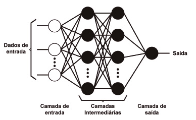
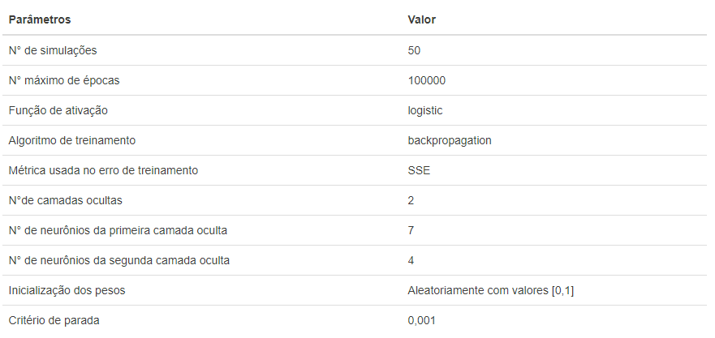

```{r setup, include=FALSE}
knitr::opts_chunk$set(echo = FALSE)
```

```{r, include=FALSE}
library(tidyverse)
library(reshape2)
library(corrplot)
library(polycor)
library(kableExtra)
library(e1071)
library(caret)
library(neuralnet)
```

## Apresentação

O presente projeto foi originado no contexto das atividades da disciplina de pós-graduação, Ciência e Visualização de Dados em Saúde, oferecida no primeiro semestre de 2022, na Unicamp, e foi desenvolvido por Mariângela Lima Rodrigues, RA 183863, aluna de mestrado em Estatística.


## Referência do Artigo

SILVA, Robson Mariano; LEAL, M. R. R.; LIMA, F. M. Predico do Câncer de Mama com Aplicação de Modelos de Inteligência Computacional. TEMA (São Carlos), v. 20, p. 229-240, 2019. Disponível em: <https://www.scielo.br/j/tema/a/yJSLsVLQmfYph8SThYCj8Xh/?lang=pt>.


## Contextualização da Proposta

O objetivo deste estudo foi reproduzir o experimento desenvolvido no artigo científico, Predição do Câncer de Mama com Aplicação de Modelos de Inteligência Computacional de Silva et.al (2019). 


## Ferramentas

- Software R Studio versão 4.1.2


## Resumo

O artigo científico no qual este projeto foi baseado trata sobre a aplicação de técnicas de inteligência computacional para a predição do câncer de mama. 

O câncer é uma doença que vêm se tornando uma das principais causas de morte no mundo, e isso se deve, em partes, ao fato de que a forma como a sociedade tem escolhido viver não inclui um conjunto de hábitos saudáveis - que são fatores fundamentais na prevenção ao câncer, conforme aponta Paulinelli et.al (2003).

Essa doença tão temida pela população pode ser desenvolvida nas mais diferentes áreas do organismo humano. No cenário geral, o que tem sido observado é que 30% dos casos de tumores, entre as mulheres, são malignos e para além disso, a doença tem sido uma das maiores causas de morte nesse grupo, com isso questões estão surgindo com respeito ao que pode ser feito para evitar que a taxa de mortes devido ao câncer de mama continue crescendo.

Existe um conjunto de fatores que dão indícios sobre o desenvolvimento do câncer de mama e a partir da identificação destes fatores inicia-se um protocolo de investigação para a detecção da doença; neste protocolo, o principal exame para o diagnóstico é a mamografia. De acordo com o Instituto Nacional de Câncer, o exame de mamografia é o único que tem se mostrado eficaz na detecção do câncer de mama e, com isso, permite que sejam aplicados tratamentos de modo a reduzir as chances de mortalidade da doença. Nesse sentido, torna-se imprescindível a realização deste exame por mulheres que apresentam alguns dos sintomas, ou por mulheres de idade mais avançada, uma vez que estudos indicam que a mamografia é mais assertiva em mulheres cuja idade esteja entre 50 e 65 anos, e o diagnóstico precoce reduz a mortalidade em 20%

A mamografia é uma importante ferramenta para realizar o diagnóstico, neste exame é feito um raio-X da mama e a partir deste, busca-se por sinais da presença do câncer. No Brasil, o Sistema Único de Saúde (SUS) garante a acessibilidade ao exame para todas as mulheres desde que solicitado por um médico, o que é refletido em uma identificação prévia e redução na taxa de mortalidade. Entretanto ressalta-se que a acurácia garantida pelo exame não é de 100%, podendo gerar tanto resultados falsos-positivos quanto falsos-negativos. Além disso, esse exame requer uma habilidade extrema do profissional que o analisa, e falhar no diagnóstico é extremamente preocupante, dado que o câncer de mama é uma doença muito grave. Nesse sentido, é importante e necessário buscar meios que auxiliem o processo de diagnóstico e o tornem mais eficiente, diminuindo os erros de leitura de exames e diagnósticos incorretos. 

Nesse contexto, a tecnologia tem se mostrado cada vez mais importante, possibilitando o diagnóstico e tratamento precoce do paciente. Sendo assim, a utilização de algoritmos de aprendizado de máquina podem potencializar novos desenvolvimentos e contribuir fortemente como aliados da medicina.


## Método e Resultados

Dada a importância da tecnologia no processo de diagnóstico de doenças, o objetivo do presente trabalho é a reprodução da aplicação do algoritmo de Redes Neurais para detecção de câncer de mama a partir do conjunto de dados Breast Cancer Wisconsin (Diagnostic) Data Set \footnote{https://www.kaggle.com/uciml/breast-cancer-wisconsin-data}, disponível em domínio público. 

As Redes Neurais (RN) são sistemas complexos que funcionam de forma similar ao sistema nervoso humano e são capazes de, através de estruturas de associação (conexões), encontrar padrões de comportamento a partir de uma entrada fornecida.

Uma rede neural artificial funciona como uma regressão, isto é, dada uma entrada de dados e a especificação do tipo de resposta desejada, obtém-se um ajuste de sinapses e suas respectivas importâncias dentro de um "emaranhado" de conexões até que seja possível caracterizar o fenômeno em análise, garantindo que o erro cometido seja mínimo. 

Considere o problema de classificação de K-classes. A construção de uma rede neural se dá em dois estágios, conforme mostrado na Figura \ref{fig:exemplo}, onde a saída k , k = 1,...,K é uma variável codificada como 0 ou 1 para a classe k, e esta é determinada a partir da criação de combinações lineares das entradas, representadas pela camada de entrada e pelas camadas intermediárias, por fim a variável resposta é modelada como uma função das camadas.

```{r exemplo, echo=FALSE, fig.align='center', fig.cap = "Exemplo de uma rede neural. Fonte: Predição do Câncer de Mama com Aplicação de Modelos de Inteligência Computacional de Silva et.al (2019)."}

```

Para construir as combinações lineares dos dados de entrada estima-se o $Z_m$ (conexões das camadas intermediárias), sendo 

$$
Z_m=\sigma(\alpha_{0_m}+\alpha_m^TX).
$$

e $m=1,2,3,...,M$ é o número de camadas ocultas, $\alpha_{0_m}$ e $\alpha_m^T$ são os pesos das sinapses e o termo $\sigma$ representa a função de ativação da rn. Usualmente $\sigma$ é escolhido como sendo a função sigmóide e por este motivo as redes neurais se assemelham a regressão logística.

É importante ressaltar que, no contexto de classificação binária, para construir a rede neural e obter as classes de interesse, em cada interação minimiza-se a entropia cruzada, apresentada na equação \ref{eq:ec}).

$$
E(W) = -\sum_{i=1}^{N}\sum_{k=1}^{K}y_{ik}log(\hat{y_{ik}})
$$

onde $i$ é o índice das N observações disponíveis, $k$ a classe da resposta, $y_{ik}$ é o valor real da observação $i$ da classe $k$ e $\hat{y_{ik}}$ é o valor predito da observação $i$ da classe $k$.

Neste experimento a aplicação da rede neural será feita com o intuito de classificação do tipo de tumor (maligno ou benigno). A seguir é apresentada a reprodução do experimento.

### Resultados

Para reproduzir o experimento, foi utilizado o diagnóstico de câncer de mama para 569 indivíduos diferentes, sendo esse diagnóstico benigno (B), para o qual foi observado um total de 357 resultados, e maligno (M), com um total de 212 observações. O conjunto de dados utilizado, foi o mesmo usado no artigo de Silva et.al, e estes trazem informação com respeito a variáveis observadas a partir da leitura de uma imagem digitalizada do aspirado por agulha fina (FNA) da massa mamária de cada indivíduo, e essas variáveis são:

* Identificador do indivíduo;
* Diagnóstico;
* Raio (média das distâncias do centro aos pontos no perímetro);
* Textura (desvio padrão dos valores da escala de cinza);
* Perímetro;
* Área;
* Suavidade (variação local nos comprimentos dos raios);
* Compacidade;
* Concavidade (severidade das porções côncavas do contorno);
* Pontos côncavos (número de porções côncavas do contorno);
* Simetria;
* Dimensão fractal.

O processo de reprodução do experimento se deu através da aplicação da função `neuralnet()` do pacote neuralnet disponível no Software R Studio. Para esta reprodução foi considerada uma aplicação como o treinamento e teste de uma rede neural, a fim de observar a performance do resultado obtido e comparar estes resultados com o experimento original. Conforme a seção de código abaixo, o conjunto de dados foi separado em um banco de treinamento (75%) e outro de teste (25%) e a rede neural foi ajustada. 

Os hiperparâmetros da rede neural foram ajustados de forma a estarem o mais próximo possível aos do experimento original, conforme mostra a Figura \ref{fig:experimento}.

```{r experimento, echo=FALSE, fig.align='center', fig.cap = "Hiperparâmetros da Rede Neural do experimento. Fonte: Predição do Câncer de Mama com Aplicação de Modelos de Inteligência Computacional de Silva et.al (2019).", out.width="70%"}

```

```{r, include=FALSE}
#Leitura dos dados
path = "C:/Users/maria/OneDrive/Documentos/Mariangela/MO826/MO826_P3"

Cancer <- read_csv(file.path(path,"data.csv"))

Cancer <- Cancer[,1:32]

names(Cancer) <- c("id", "Diagnóstico","Raio Médio", "Textura Média", "Perímetro Médio", "Área Média", "Suavidade Média", "Compacidade Média", "Concavidade Média", "Pontos Côncavos Médio", " Simetria Média", "Dimensão fractal Média","Raio DP", "Textura DP", "Perímetro DP", "Área DP", "Suavidade DP", "Compacidade DP", "Concavidade DP", "Pontos Côncavos DP", " Simetria DP", "Dimensão fractal DP","Pior Raio", "Pior Textura", "Pior Perímetro", "Pior Área", "Pior Suavidade", "Pior Compacidade", "Pior Concavidade", "Piores Pontos Côncavos", "Pior Simetria", "Pior Dimensão fractal")

Cancer$Diagnóstico <- as.factor(Cancer$Diagnóstico)

df <- Cancer %>%
  rename("diagnostico" = `Diagnóstico`, "raio.medio" = `Raio Médio`, "textura.media" = `Textura Média`, "perimetro.medio" = `Perímetro Médio`, "area.media" = `Área Média`, "suavidade.media" = `Suavidade Média`, "compacidade.media" = `Compacidade Média`, "concavidade.media" = `Concavidade Média`, "pontosconcavos.medio" = `Pontos Côncavos Médio`, "simetria.media" = ` Simetria Média`, "dimensaofractal.media" = `Dimensão fractal Média`, "raio.dp" = `Raio DP`, "textura.dp" = `Textura DP`, "perimetro.dp" = `Perímetro DP`, "area.dp" = `Área DP`, "suavidade.dp" = `Suavidade DP`, "compacidade.dp" = `Compacidade DP`, "concavidade.dp" = `Concavidade DP`, "pontosconcavos.dp" = `Pontos Côncavos DP`, "simetria.dp" = ` Simetria DP`, "dimensaofractal.dp" = `Dimensão fractal DP`, "pior.raio" = `Pior Raio`, "pior.textura" = `Pior Textura`, "pior.perimetro" = `Pior Perímetro`, "pior.area" = `Pior Área`, "pior.suavidade" = `Pior Suavidade`, "pior.compacidade" = `Pior Compacidade`, "pior.concavidade" = `Pior Concavidade`, "piorespontos.concavos" = `Piores Pontos Côncavos`, "pior.simetria" = `Pior Simetria`, "piordimensao.fractal" = `Pior Dimensão fractal`) %>%
  mutate_if(is.numeric, scale)

```

```{r, echo=TRUE}
set.seed(003) #semente para reprodução nas mesmas configurações

treino_id <- sample(1:nrow(df), 0.75*nrow(df))
treino <- df[treino_id,] #df: base de dados normalizada
treino <- as.data.frame(treino[,-1]) %>%
  drop_na()

teste <- df[-treino_id,]
teste <- as.data.frame(teste[,-1]) %>%
  drop_na()

modelrn <- neuralnet(diagnostico~., data = treino,
                     hidden = c(2,7,4),
                     threshold = 0.001,
                     rep = 50,
                     act.fct = "logistic",  
                     err.fct = "sse")

```

A partir do resultado obtido, foi construída a matriz de confusão, apresentada na Tabela \ref{tab:mc}, usando os dados de teste do modelo.

```{r}
result_matrix <- data.frame(modelrn$result.matrix)

previsto <- neuralnet::compute(modelrn, teste, 1)
resultado <- data.frame(atual = teste$diagnostico,
                        predito = previsto$net.result)

roundedresults <- resultado %>%
  mutate_if(is.numeric, round) %>%
  select(-predito.1)

confusion <- table(roundedresults$atual, roundedresults$predito)

confusion <- data.frame(confusion) %>% 
  mutate(Var2 = if_else(Var2 == 0, "B", "M")) %>%
  spread(Var2,Freq) %>%
  mutate(" " = c("Valor Real"), "  " = Var1) %>%
  dplyr::select(" ", "  ", "B", "M")

acuracia <- round((confusion$B[1]+confusion$M[2])/(confusion$B[1]+confusion$M[2]+confusion$B[2]+confusion$M[1]),4)*100 

sensibilidade <- round((confusion$M[2])/(confusion$B[2]+confusion$M[2]),4)*100

especificidade <- round((confusion$B[1])/(confusion$B[1]+confusion$M[1]),4)*100

```

```{r mc}
kable(confusion, caption = "Matriz de Confusão", booktabs = T, align = "rrr")  %>% 
  collapse_rows(c(1,2),latex_hline = "major") %>%
  kable_styling(position="center", latex_options = c("HOLD_position", "striped")) %>%
  add_header_above(c(" " = 2,"Valor Predito" = 2))

# min(result_matrix[1,])
# max(result_matrix[1,])
```

A partir da Tabela 1 é possível extrair métricas do modelo ajustado e observa-se que a acurácia obtida foi de `r paste0(acuracia, "%")`, a sensibilidade foi de `r paste0(sensibilidade, "%")` e a especificidade foi igual a `r paste0(especificidade, "%")`. Para além disso, o erro das simulações variou entre 0.0003 e 3.9409. Estes resultados se assemelham aos obtidos pelo artigo de Silva et.al a partir do uso de Redes Neurais como método para predição de câncer de mama. 

Com isto, concluí-se a reprodução do experimento do artigo científico  Predição do Câncer de Mama com Aplicação de Modelos de Inteligência Computacional.


## Referências Bibliográficas

[1] PAULINELLI, Régis Resende et al. A situação do câncer de mama em Goiás, no Brasil e no mundo: tendências atuais para a incidência e a mortalidade. Revista Brasileira de Saúde Materno Infantil, v. 3, n. 1, p. 17-24, 2003.

[2] SILVA, Robson Mariano; LEAL, M. R. R.; LIMA, F. M. Predico do Câncer de Mama com Aplicação de Modelos de Inteligência Computacional. TEMA (São Carlos), v. 20, p. 229-240, 2019. Disponível em: <https://www.scielo.br/j/tema/a/yJSLsVLQmfYph8SThYCj8Xh/?lang=pt>.
