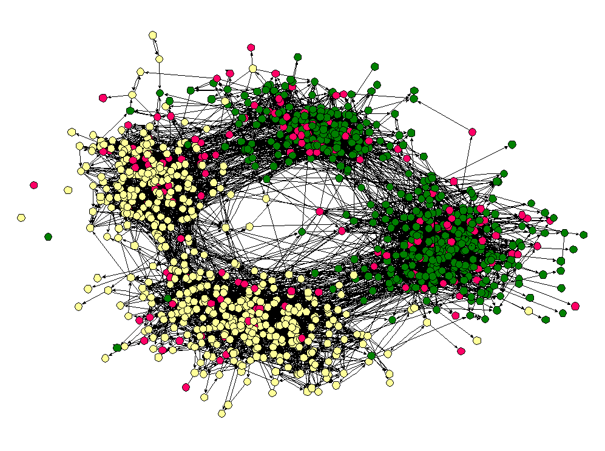
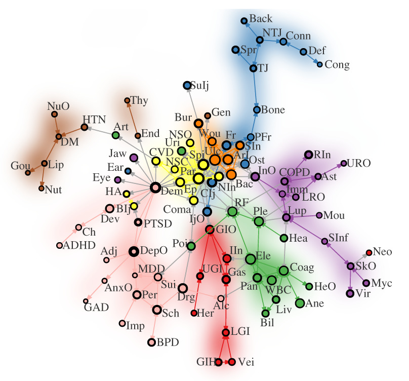

```{r setup, include=FALSE}
knitr::opts_chunk$set(echo = FALSE, warning = FALSE)
```

```{r, include=FALSE}
library(tidyverse)
library(igraph)
```

## Apresentação

O presente projeto foi originado no contexto das atividades da disciplina de pós-graduação, Ciência e Visualização de Dados em Saúde, oferecida no primeiro semestre de 2022, na Unicamp, e foi desenvolvido por Mariângela Lima Rodrigues, RA 183863, aluna de mestrado em Estatística.


## Referência do Artigo

Alexander-Bloch Aaron F., Raznahan Armin, Shinohara Russell T., Mathias Samuel R., Bathulapalli Harini, Bhalla Ish P., Goulet Joseph L., Satterthwaite Theodore D., Bassett Danielle S., Glahn David C. e Brandt Cynthia A., 2020. A arquitetura das redes de co-morbidade das condições de saúde física e mental dos veteranos militares. Proc. R. Soc. A. 4762019079020190790. Disponível em: <http://doi.org/10.1098/rspa.2019.0790>.

## Contextualização da Proposta

O objetivo deste estudo foi reproduzir o experimento desenvolvido no artigo científico, "The architecture of co-morbidity networks of physical and mental health conditions in military veterans" de Aaron F. et.al (2020).


## Ferramentas

- Software R Studio versão 4.1.2

## Resumo

O artigo de Aaron F. et.al (2020) tem como objetivo encontrar uma arquitetura de redes que estabelece conexões entre as chances de doenças físicas aumentarem em detrimento da presença de doenças psiquiátricas e vice-versa. Para isso, os autores estimam as chances através de modelos de regressão logística e os parâmetros filtrados desses modelos servem como base para a matriz de adjacência da rede, permitindo assim a identificação de padrões de comportamento da associação entre condições médicas e psiquiátricas. Neste projeto, usamos o pacote `igraph` para reproduzir os resultados obtidos no artigo.

## Método e Resultados

A ciência de redes, têm se mostrado objeto de estudo de extremo interesse. Isto se deve ao fato de que o mundo é composto, em sua essência, por inúmeros sistemas de redes, sejam eles no âmbito social (vínculos sociais), tecnológico (redes de celulares ou internet), biológico (como o organismo reage a um determinado estímulo), ou em qualquer outro setor que se possa pensar.

Redes complexas, independentemente da forma/ambiente em que se encontram, são estruturas que se comportam como nós conectados por links, e estes últimos representam a forma como os nós interagem entre si. O interessante é que independentemente do contexto em que se observa uma rede complexa, o comportamento dessa estrutura é o mesmo, ou seja, é possível identificarmos um conjunto de regras que regem seu funcionamento. A Figura \ref{fig:exemplo_rede} apresenta um exemplo de redes complexas, na qual se pode observar a rede de amigos numa escola dos Estados Unidos. 

```{r exemplo_rede, echo=FALSE, out.width="70%", fig.align='center', fig.cap = "Exemplo de rede complexa: rede de amigos em uma escola dos Estados Unidos. FONTE: Mendes (2005). Disponível em https://www.spf.pt/magazines/GFIS/78/article/503/pdf."}


```

Em decorrência das regras que norteiam o funcionamento de uma rede é possível compreender o funcionamento das mesmas e modelar esse mecanismo comum a partir de gráficos, uma abstração matemática que permite uma melhor compreensão do funcionamento de uma rede complexa.

Para compreendermos o funcionamento de uma rede complexa é necessário representá-la matematicamente e, posterior a representação matemática podemos abstrair a informação por meio de um gráfico. Conforme explica Angélica da Mata (2020), uma rede pode ser representada através de uma matriz de adjacência. Em uma rede cujas conexões possuem a mesma importância, isto é, o mesmo peso, a matriz de adjacência é então representada por

\begin{center}

$Um_{ij}$ = 1, se os vértices $i$ e $j$ estão conectados e 0 caso contrário.

\end{center}

Se a matriz $Um_{ij}$ é simétrica, então todos os nós da rede estão conectados e configura-se um gráfico sem peso e não direcionado. Enquanto que para redes em que pelo menos um par de nós não está ligado, a matriz de adjacência não é simétrica e a rede é dita direcionada. Nos casos em que as conexões têm pesos diferentes a matriz de adjacência assumirá o valor $w_{ij}$, onde $0\leq w_{ij}\leq 1$ é o peso da referida conexão entre os nós $i$ e $j$.

A partir da matriz de adjacência é possível estabelecer o número de vizinhos mais próximos de cada um dos vértices da rede e a partir disso determinar, por exemplo, qual o nível de centralidade de cada um dos nós, qual a distância entre os nós e quais são os caminhos que os conectam entre outras características. A determinação dos pontos de centralidade é uma qualidade importante no estudo de redes porque através dela podemos, por exemplo, determinar onde uma epidemia teve início, qual a região em que a contaminação por um vírus ocorre de maneira mais rápida, quais poderiam ser as ações tomadas com base na distância entre os pontos de contaminação e etc.

Outras duas características importantes das redes é a formação de subgrafos que indicam comportamentos de agrupamento dentro de uma rede e nos permite entender quais as razões pelas quais um grupo de pessoas interage de forma mais intrínseca do que com outros grupos e a influência com que os nós têm no comportamento da rede como um todo.

Em redes menores é simples determinarmos as conexões e o comportamento do sistema como um todo, entretanto, à medida que o número de conexões aumenta torna-se necessário usar ferramentas estatísticas que nos permitam estimar o grau das conexões e o funcionamento da rede em termos da distribuição desses graus. Na seção seguinte mostramos a aplicação da ciência de redes através da reprodução do estudo desenvolvido no artigo de Alexander-Bloch Aaron F et.al (2020). 

O estudo de relações entre condições psiquiátricas e médicas é de extrema importância, haja vista que em diversos casos de observam-se características que indicam a presença de associação entre esses dois campos da saúde humana. Apesar de evidenciadas tais relações, a compreensão de como o fenômeno de co-ocorrência de casos clínicos e doenças psiquiátricas é um problema difícil de ser tratado através dos modelos mais comuns de diagnóstico. O uso de redes complexas neste contexto é, portanto, uma estratégia que possibilita melhorar como esses movimentos de ocorrência de doenças que afetam a saúde física e mental da população de forma simultânea. 

No artigo de referência deste projeto os autores se propuseram a analisar estruturas de redes complexas no que diz respeito ao desenvolvimento de doenças físicas e mentais que afetam ex-militares dos Estados Unidos.

Para o desenvolvimento do estudo, Aaron F. et.al tomaram uma amostra de veteranos do exército dos EUA com características específicas e a partir disto selecionaram, através dos registros clínicos destes veteranos, condições médicas e psiquiátricas de interesse. Feito isso, os autores buscaram determinar se a chance de diagnóstico de uma doença é afetada pelo diagnóstico de uma condição psiquiátrica e vice-versa. Para isso determinar essa relação de associação entre as diferentes condições foi usado um modelo de regressão logística e a partir dele as chances foram obtidas. 

Após esta primeira etapa de modelagem e entendimento dos dados o estudo foi direcionado a modelagem de redes complexas de tal modo que fosse possível compreender, dentre as condições clínicas que apresentaram associação estatisticamente significativa com condições psiquiátricas.

Os autores disponibilizaram o conjunto de dados das chances de diagnóstico em decorrência de condições médicas e psiquiátricas e que foi utilizado para construir a rede apresentada por eles, e a partir desse conjunto de dados construímos uma rede que é apresentada na seção seguinte.

Para construir a rede do artigo de referência, os autores levaram em consideração apenas os coeficientes do conjuntos de modelos de regressão logística que foram estatisticamente significativos e que apresentaram taxa de falsos positivos inferior à 5%. Além disso, eles consideraram ainda apenas os coeficientes positivos, ou seja, que indicam alteração positiva, isto é, aumento da chance de uma doença física $x$ em decorrência da presença de uma doença psiquiátrica $y$.

Para reproduzir o experimento realizado foi usado o conjunto de dados disponibilizado e a partir do pacote `igraph` disponível no R Studio aplicamos as funções deste pacote, como por exemplo `graph_from_adjacency_matrix()`, para obter a matriz de adjacência da rede. As Figuras \ref{fig:experimento} e \ref{fig:original} apresentam, respectivamente, os resultados da rede reproduzida e a rede original apresentada no artigo de referência.

Para econtrar as comunidades destacadas pelo artigo, usamos a função `cluster_fluid_communities()` e determinamos o número de comunidades igual a 7, de modo que pudéssemos tentar reconstruir a rede original.

\newpage

```{r}
set.seed(001)
data <- as.matrix(read.csv("https://raw.githubusercontent.com/aaronab/comorbidity_networks/master/comorbidity_odds_matrix.csv", row.names = 1))

shortnamevec <- c("Her","Def","Adj","Ane","Ast","ADHD","Bac","Bil","Bur",
                  "NIn","CVD","COPD","Ulc","Coag","Coma","CIj",
                  "Dem","Dev","Art","Mou","Hea","Uri","Vei","WBC",
                  "Lip","Jaw","Ch","Ear","Ep","Eye","Ele",
                  "Fr","GIH","Gou","HA","NSC","HTN","Imm","Imp",
                  "ArI","IIn","BIj","TJ","Liv","LGI","Myc",
                  "NTJ","Gas","Nut","Wou","Ost","Bone","Conn","End",
                  "GIO","HeO","InO","SInf","IjO","LRO","NSO",
                  "NuO","SkO","URO","Pan","Par","PFr","Per","Ple",
                  "Poi","RF","RIn","SIn","Spi","Back","Spr","Sui",
                  "SuIj","Lup","Thy","UGI","Vir","Alc","Drg","Sch","MDD",
                  "BPD","PTSD","DepO","AnxO","GAD","DM","Neo","Cong","Gen")

whichpsych <- c(3,6,17, 18, 27, 39, 68 ,77 ,83 ,84 ,85, 86, 87,
                88, 89, 90, 91)

rownames(data) <- colnames(data) <- shortnamevec

G.oddsmat <- graph_from_adjacency_matrix(t(data), 
                                         mode = 'directed', 
                                         diag = F, weighted = T)

namevec <- row.names(data)

V(G.oddsmat)$color <- 'Black'

V(G.oddsmat)$color[V(G.oddsmat)$name %in% namevec[whichpsych]] <- 'tomato'

G.oddsmat.2 <- delete_edges(G.oddsmat, E(G.oddsmat)[weight<1])

G.oddsmat.3 <- decompose(G.oddsmat.2, min.vertices = 3)[[1]]

communities <- cluster_fluid_communities(G.oddsmat.3, no.of.communities = 7)

colrs <- adjustcolor( c("#FFF000", "#33FF00", "#0033FF", "#CC33CC", 
                        "#FF3300", "#CC0099", "#669999"), alpha=.6)

df <- data %>%
  as.data.frame() 

df %>%
  gather(doencas, odds, c(colnames(df))) %>%
  write.csv("C:/Users/maria/Downloads/df.csv")

```

```{r experimento, echo=FALSE, out.width="75%", fig.align='center', fig.cap = "Rede gerada a partir da reprodução do experimento do artigo de Alexander-Bloch Aaron F et.al (2020)."}
plot(communities, G.oddsmat.3, vertex.label.cex = 0.5, 
     vertex.label.color = "black", edge.arrow.size = 0.2)
```

```{r original, echo=FALSE, out.width="40%", fig.align='center', fig.cap = "Rede de referência do experimento do artigo de Alexander-Bloch Aaron F et.al (2020)."}

```

Notamos que a rede encontrada a partir da reprodução do experimento, Figura \ref{fig:experimento}, apesar de possuir um formato diferente, preserva as características da rede apresentada no artigo de referência \ref{fig:original}. Podemos observar, por exemplo, que os nós Cong, Def, Conn, Back, e assim por diante, se agruparam em uma mesma comunidade, e da mesma forma as demais comunidades se formaram. 

Concluímos portanto a reprodução do experimento do artigo selecionado e também, a partir do estudo do mesmo, a relevância do uso de redes complexas como forma de diagnosticar padrões de associação entre doenças psiquiátricas e clínicas que, comumente, passam desapercebidas e podem afetar desde as políticas de saúde até formas de tratamento de pacientes e prevenção de doenças.

\newpage

## Referências Bibliográficas

[1] Alexander-Bloch Aaron F., Raznahan Armin, Shinohara Russell T., Mathias Samuel R., Bathulapalli Harini, Bhalla Ish P., Goulet Joseph L., Satterthwaite Theodore D., Bassett Danielle S., Glahn David C. e Brandt Cynthia A., 2020. A arquitetura das redes de co-morbidade das condições de saúde física e mental dos veteranos militares. Proc. R. Soc. A. 4762019079020190790. Disponível em: <http://doi.org/10.1098/rspa.2019.0790>.

[2] Mata, A.S.D. Complex Networks: uma mini-revisão. Braz J Phys 50, 658-672 (2020). Disponível em: <https://doi.org/10.1007/s13538-020-00772-9>.


